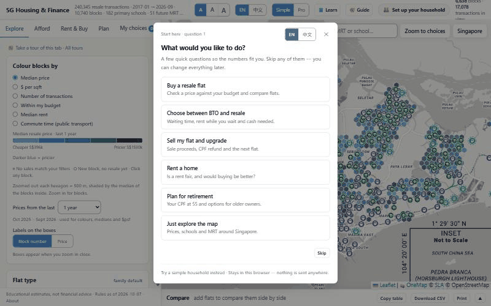
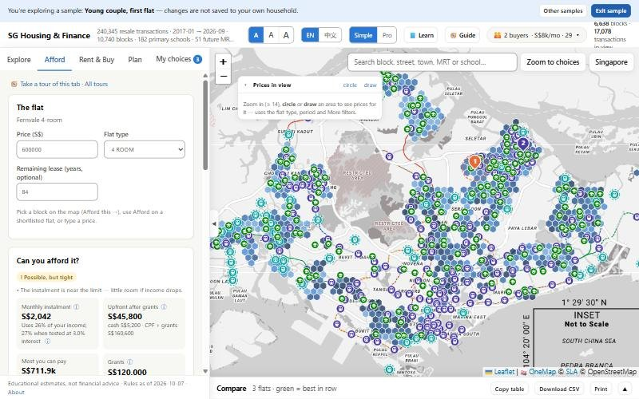
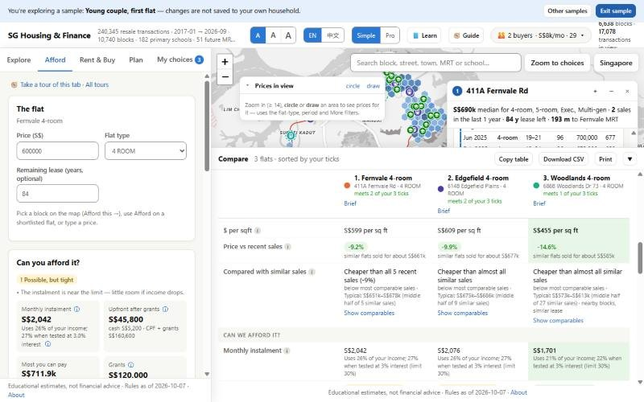
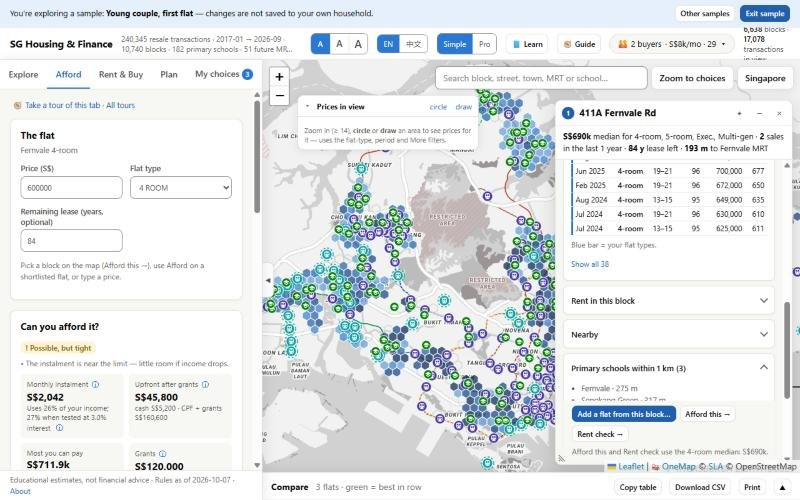
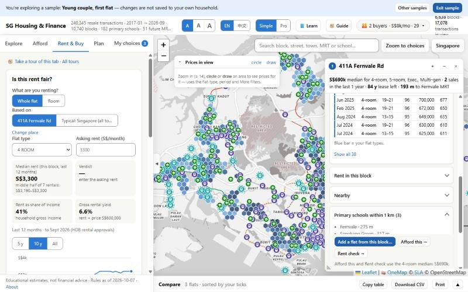
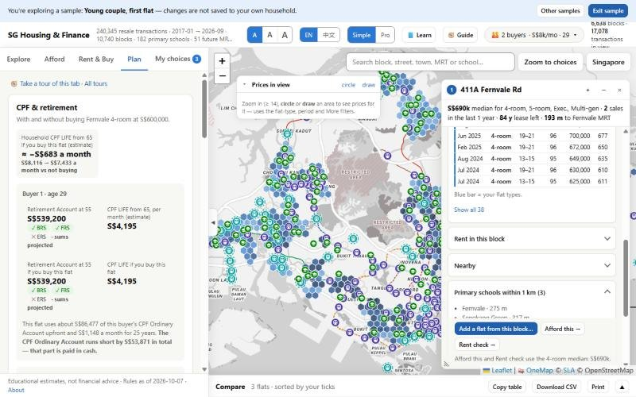
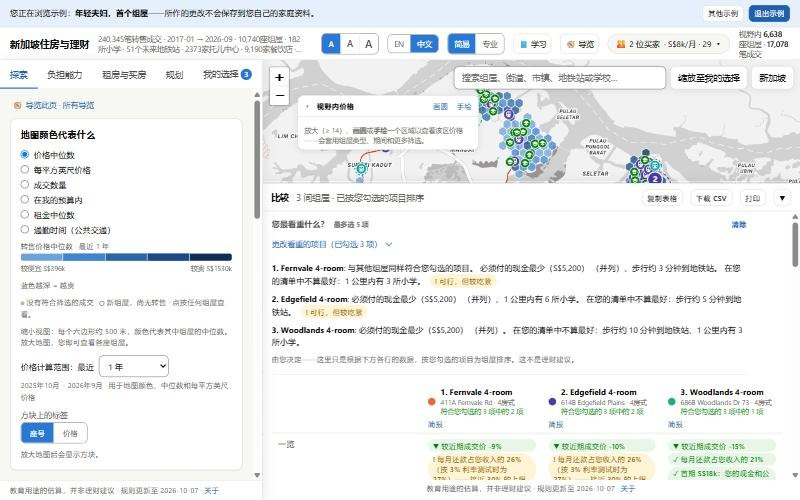

<div align="center">


# SG Housing & Finance

**Can we afford this flat? Plain answers, Singapore's real rules,<br>and your numbers never leave your browser.**

### 👉 [Open the app — heng8835.github.io/sg-housing-finance](https://heng8835.github.io/sg-housing-finance/)

Free · no sign-up · works on desktop (phone layout being improved) · English and 中文 · [Support on Ko-fi ☕](https://ko-fi.com/zhlim)

[](https://heng8835.github.io/sg-housing-finance/)
[](https://github.com/heng8835/sg-housing-finance/actions/workflows/ci.yml)
[](LICENSE)
[](DATA_LICENCES.md)
[](#privacy)
[](README.zh.md)

**English** · [简体中文](README.zh.md)



</div>

---

You found a 4-room in Punggol. The agent says it's a good price. Your parents would rather you stay near them in
Bishan. Your CPF statement is somewhere in your email, and nobody can tell you how much cash you actually need on
the day.

**SG Housing & Finance puts all of that on one page**: every HDB resale sale on a map, what *your* household can
pay, the grants and the cash you must have, schools and clinics near each flat, and a side-by-side comparison
in words you don't need a banker to read. Free, no account, English and 中文.

> **Educational estimates, not financial advice.** Check prices, eligibility, loans and grants with HDB, CPF Board,
> IRAS and your bank before you commit. Not affiliated with, or endorsed by, any Singapore government agency.

## What it answers

| | Question | Where |
|---|---|---|
|  | **"How much can we pay, and how much cash do we need?"**<br>Most you can pay, HDB vs bank loan, grants, cash vs CPF, the real monthly cost, counting the sale of your current flat. | Afford |
|  | **"Which of these flats fits us?"**<br>Tick what matters (cash, MRT walk, schools, lease…) and get one plain sentence per flat. Price against recent sales, money rows, lease, family rows, a one-page brief to print. | Compare |
|  | **"What's around this block?"**<br>Every HDB block, including never-resold ones: recent prices, rents, primary schools within 1 km, childcare with places, clinics, MRT, commute time. | Explore |
|  | **"Is our rent fair? Should we buy instead?"**<br>Which paths are open to your household, fair-rent check (or your own room rent), rent vs buy. | Rent & Buy |
|  | **"What does this do to our CPF and retirement?"**<br>CPF with and without the flat, CPF LIFE estimate, sell-then-buy timeline, key dates (.ics), options at 55+. | Plan |
|  | **"可以用中文吗？"**<br>Every screen, guide and glossary term in 简体中文, plus a larger text size. | everywhere |

## Numbers

<div align="center">

| 240,345 | 10,740 | 188 | 813 | 0 |
|:---:|:---:|:---:|:---:|:---:|
| resale sales since 2017 | HDB blocks on the map | Singapore rules, each with its official source and date | automated tests | trackers |

</div>

Every rule value (loan limits, rates, stamp-duty bands, CPF and grant rules) lives in one file,
[`app/policy/sg-policy.json`](app/policy/sg-policy.json), with its official source, the date it takes effect and
whether it was verified. The code never types a rule from memory. When the yearly review date passes, the app says
so on every page.

## Before / after

| Without | With |
|---|---|
| HDB resale page, CPF calculators, a bank's loan calculator, a listing site, MOE's school finder, a map — six tabs and a spreadsheet | One page, one household, the same numbers on every screen |
| "Within budget" from a listing that doesn't know your CPF or grants | Cash you must pay, from CPF and grants, and the most you can pay — for **your** household |
| Percentiles and jargon (MSR, TDSR, COV) | "Cheaper than all 5 recent sales here" · "Monthly loan about a quarter of your pay" |

## Privacy

**Your finances stay in your browser.** Income, CPF, savings and your shortlist are kept only in this browser's
storage. They never go into a URL, a request, a log or analytics — there are no analytics. The page talks to
three places: this site, cdnjs (the map library, pinned by integrity hashes) and OneMap (map tiles only).
**Forget my data** clears everything.

This is enforced by tests ([`tests/privacy/`](tests/privacy)): marker values typed into a household must never
appear in any URL, request or console line, and every network call is on a reviewed allow-list.

## How it works

```
data.gov.sg (HDB, URA, LTA, MOE, ECDA, MOH, NEA, NParks)    OneMap · OpenStreetMap
            │                                                      │
            ▼                                                      ▼
   hdb-data-pipeline (Dagster)  ──►  tools/*.py  ──►  app/data/*.js (generated)
                                                           │
   app/policy/sg-policy.json (dated, sourced rules) ───────┤
                                                           ▼
                        static web app (no server, no build step)
                        engine/  pure calculations · modules/  one per tab
                        your household → this browser only
```

## FAQ

<details><summary><b>Is this financial advice?</b></summary>

No. It shows educational estimates from public data and dated rules. It never says "buy this". Check with HDB,
CPF Board, IRAS and your bank before you commit.
</details>

<details><summary><b>Where does my data go?</b></summary>

Nowhere. It stays in your browser's storage on your device. There is no account, no server that receives it and
no analytics. See [Privacy](#privacy).
</details>

<details><summary><b>How current are the rules and prices?</b></summary>

Prices: HDB resale data up to the month shown in the app header, updated with each data refresh. Rules: the "Rules as of" date on
every page; each rule links to its official page. The rules are reviewed every January (CPF changes on 1 January).
</details>

<details><summary><b>Why are there no BTO projects or flood-prone areas?</b></summary>

Their sources don't allow republishing, so this public version leaves them out rather than break the terms.
The BTO card still works from a price you type, and the Compare table points to PUB's own flood list.
</details>

<details><summary><b>Is it linked to HDB or CPF Board?</b></summary>

No. Agency names say where the data comes from, nothing more.
</details>

<details><summary><b>I found a wrong number.</b></summary>

Thank you — please [open an issue](https://github.com/heng8835/sg-housing-finance/issues/new/choose) with the
"Wrong number" template. **Never paste your income, CPF balances, savings or names**: issues are public.
</details>

## For developers

<details><summary><b>Run it locally</b></summary>

The app is static files (ES modules), so it needs a local web server — `file://` does not work.

```bash
serve.cmd                        # Windows; or: python tools/serve.py   -> http://localhost:8766
npm test                         # app tests (Node 22, no dependencies; also runs the tools' Python tests)
npm run fixtures:check           # characterisation fixtures still match
docker compose up                # app -> http://localhost:8080, Dagster -> http://localhost:3000
```

The data pipeline (Python 3.10+):

```bash
cd hdb-data-pipeline
pip install -e .[dev]
cp .env.example .env             # optional: proxy, data folder, Google Sheets mirror (every value optional)
python -m pytest -q              # no network
python pipelines/run_resale.py   # one manual run -> data/processed/
dagster dev -m dagster_project.definitions -p 4141   # Dagster UI -> http://localhost:4141
```
</details>

<details><summary><b>Refresh the app's data</b></summary>

After a pipeline run (writes `app/data/`; full order and timings in [`app/README.md`](app/README.md)):

```bash
python tools/build_data.py         # transactions + MRT -> data.js
python tools/fetch_hdb_blocks.py   # every HDB block -> tools/hdb_blocks.json (then build_data.py again)
python tools/fetch_poi.py          # schools, childcare, eldercare, parks, bus stops, malls, supermarkets, eateries
python tools/fetch_bus_routes.py   # bus services as stop sequences
python tools/fetch_future_rail.py  # future MRT stations + curated line plans
python tools/fetch_rents.py        # rents
python tools/fetch_market.py       # price index, land use, unit mix
python tools/fetch_family_health.py  # childcare vacancies, clinics
python tools/build_commute.py      # commute estimates
python tools/build_sw_manifest.py  # offline-copy manifest (after ANY change under app/)
```

Or the whole chain in one go, with a change report and sanity checks: `python tools/refresh_all.py --dry-run`
(plan + summary of the current data), then `python tools/refresh_all.py`. OneMap calls use a token when
`ONEMAP_EMAIL` / `ONEMAP_PASSWORD` are set (environment only), and go out anonymously otherwise.
</details>

<details><summary><b>Repository layout</b></summary>

| Path | What is there |
|---|---|
| `app/` | The web app: `index.html`, `main.js`, `core/` (store, data, i18n, policy lookup), `engine/` (pure calculations, no DOM), `modules/` (one folder per tab / feature), `policy/sg-policy.json`, `i18n/` (中文), `content/` (glossary + guides), `data/` (generated — never edit) |
| `tools/` | Python generators for `app/data/`, the local server, the Pages staging and export scripts |
| `tests/` | Node tests for the app (`npm test`), fixtures, privacy tests, Python tests for the tools |
| `hdb-data-pipeline/` | Dagster pipeline: data.gov.sg → geocode → enrich → validate → CSV ([README](hdb-data-pipeline/README.md)) |
| `docs/` | [`MODULE_MAP.md`](docs/MODULE_MAP.md) (one row per source file), [fair-value backtest](docs/backtest-fair-value.md) |
| `.github/` | CI (`tests`), Pages deploy, policy-review reminder, issue templates |

Design notes: [`PROJECT_BRIEF`](hdb-data-pipeline/docs/PROJECT_BRIEF.md) ·
[`SYSTEM_DESIGN`](hdb-data-pipeline/docs/SYSTEM_DESIGN.md) · [`DATA_MODEL`](hdb-data-pipeline/docs/DATA_MODEL.md) ·
[`BUSINESS_RULES`](hdb-data-pipeline/docs/BUSINESS_RULES.md) · [`CHANGELOG`](CHANGELOG.md).
</details>

## Data sources

Public data from data.gov.sg (HDB, URA, LTA, MOE, ECDA, MOH, NEA, NParks) under the Singapore Open Data Licence,
map tiles from OneMap (© Singapore Land Authority) and OpenStreetMap (© OpenStreetMap contributors, ODbL).
Dataset by dataset, with terms: [`DATA_LICENCES.md`](DATA_LICENCES.md).

Caveats: distances are straight-line; future MRT lines, major projects and former burial grounds are curated by
hand and approximate; commute times are a model, not a journey planner.

## Support


SG Housing & Finance is free. If it helped you, you can support it on [Ko-fi](https://ko-fi.com/zhlim) ☕ — thank you!
<br clear="left">

## Feedback

Found a wrong number or a data problem? [Open an issue](https://github.com/heng8835/sg-housing-finance/issues/new/choose)
— and **never paste your income, CPF balances, savings or names**: issues are public.

## Licence

Code: MIT — see [LICENSE](LICENSE). Data keeps the terms of its sources ([`DATA_LICENCES.md`](DATA_LICENCES.md)).
