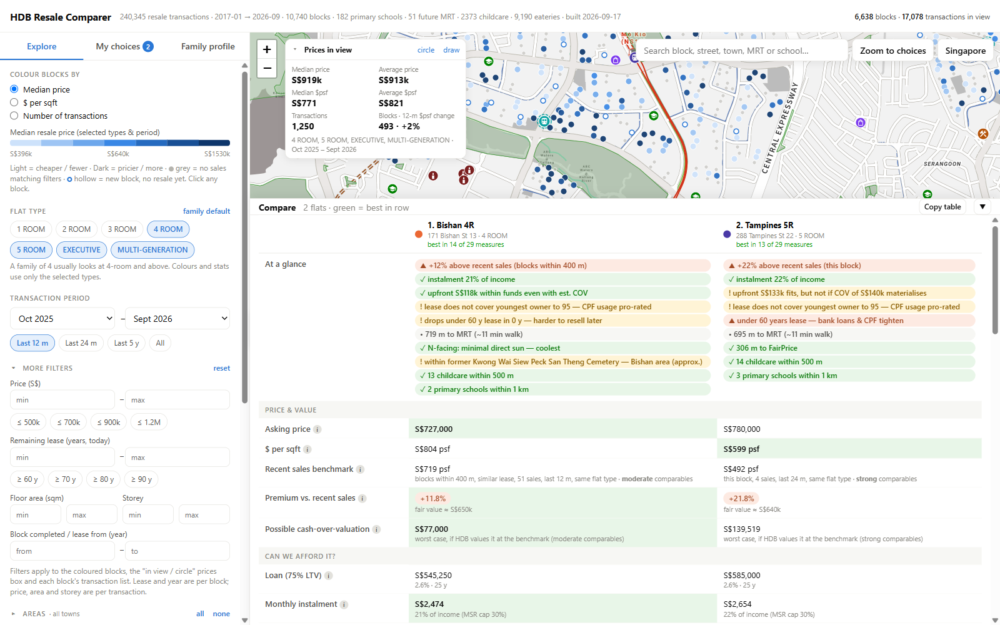

# SG Housing & Finance

A free, browser-only tool for people buying, selling or renting an HDB flat in Singapore: explore every resale
transaction on a map, check what you can afford, compare flats side by side and plan CPF and retirement around
the purchase — in English or 中文.

**Live (after launch):** <https://heng8835.github.io/sg-housing-finance/> · no sign-in, no account, no tracking.



> **Educational estimates, not financial advice.** Check prices, eligibility, loans and grants with HDB, CPF Board,
> IRAS and your bank before you commit. This project is not affiliated with, or endorsed by, any Singapore
> government agency.

## What it does

| Area | What you can do |
|---|---|
| **Explore** | Every HDB block on a map (including ones never resold), coloured by price, $psf, rent, commute or your budget; area prices for a circle or a shape you draw; schools, childcare, clinics, MRT (incl. future lines), bus, parks, hawkers and more |
| **Compare** | Your shortlisted flats side by side: price against comparable recent sales, money rows from the same engine as Afford, lease left, commute, family rows, future-value drivers; one-page print brief, CSV, share link (flats only) |
| **Afford** | Most you can pay, both loan types, monthly cost, upfront cash vs CPF, grants, stress test, counting the sale of your current flat; named scenarios to compare |
| **Rent & Buy** | Which paths are open to your household, whether a rent is fair, rent vs buy (with optional Monte-Carlo ranges), renting out |
| **Plan** | CPF with vs without the flat, CPF LIFE estimate, sell then buy (proceeds, timeline, completion gap), key dates (.ics), options at 55+, primary schools by P1 distance band, BTO vs resale from a price you type |
| **Learn** | Glossary, step-by-step guides with quizzes, a log of rule changes, sample households to try without typing your own |

Every Singapore rule value (loan limits, rates, stamp-duty bands, CPF and grant rules) lives in one file,
[`app/policy/sg-policy.json`](app/policy/sg-policy.json), with its official source, effective date and status —
the code never hard-codes them, and the tests fail when the file is due for review.

## Privacy

**Your personal finances stay in your browser.** Household details, income, CPF, savings and your shortlist are kept
only in this browser's `localStorage` (and in files you choose to save). They are never put in a URL, a request,
a log or analytics — there are no analytics. The page talks to three places only: this site (the app and its data
files), cdnjs (the Leaflet map library, pinned by integrity hashes) and OneMap (map tiles only; the *Daily places* search
runs on the app's own data). Household → **Forget my data** clears everything the app saved.

This is enforced by tests (`tests/privacy/`): marker values typed into a household must never appear in any URL,
request or console line, and every network call site is on a reviewed allow-list.
Details: [`app/README.md`](app/README.md#privacy-guarantee--your-finances-never-leave-the-browser).

## Run it locally

The app is static files (ES modules — it needs a local web server, `file://` does not work).

```bash
serve.cmd                        # Windows; or: python tools/serve.py   -> http://localhost:8766
npm test                         # app tests (Node 22, no dependencies; also runs the tools' Python tests)
npm run fixtures:check           # characterisation fixtures still match
docker compose up                # app -> http://localhost:8080, Dagster -> http://localhost:3000
```

The data pipeline (Python 3.10+):

```bash
cd hdb-data-pipeline
pip install -e .[dev]
cp .env.example .env             # optional: proxy, data folder, Google Sheets mirror (every value optional)
python -m pytest -q              # no network
python pipelines/run_resale.py   # one manual run -> data/processed/
dagster dev -m dagster_project.definitions -p 4141   # Dagster UI -> http://localhost:4141 (weekly schedule ships stopped)
```

Refresh the app's data after a pipeline run (writes `app/data/`; see [`app/README.md`](app/README.md) for the full
order and timings):

```bash
python tools/build_data.py         # transactions + MRT -> data.js
python tools/fetch_hdb_blocks.py   # every HDB block -> tools/hdb_blocks.json (then build_data.py again)
python tools/fetch_poi.py          # schools, childcare, eldercare, parks, bus stops, malls, supermarkets, eateries
python tools/fetch_bus_routes.py   # bus services as stop sequences
python tools/fetch_future_rail.py  # future MRT stations + curated line plans
python tools/fetch_rents.py        # rents
python tools/fetch_market.py       # price index, land use, unit mix
python tools/fetch_family_health.py  # childcare vacancies, clinics, flood points
python tools/build_commute.py      # commute estimates
python tools/build_sw_manifest.py  # offline-copy manifest (after ANY change under app/)
```

## Repository layout

| Path | What is there |
|---|---|
| `app/` | The web app: `index.html`, `main.js`, `core/` (store, data, i18n, policy lookup), `engine/` (pure calculations, no DOM), `modules/` (one folder per tab / feature), `policy/sg-policy.json`, `i18n/` (中文), `content/` (glossary + guides), `data/` (generated — never edit) |
| `tools/` | Python generators for `app/data/`, the local server, the Pages staging and public-export scripts |
| `tests/` | Node tests for the app (`npm test`), fixtures, privacy tests, Python tests for the tools |
| `hdb-data-pipeline/` | Dagster-orchestrated pipeline: data.gov.sg → geocode → enrich → validate → CSV ([README](hdb-data-pipeline/README.md)) |
| `docs/` | [`MODULE_MAP.md`](docs/MODULE_MAP.md) (one row per source file), [fair-value backtest](docs/backtest-fair-value.md) |
| `.github/` | CI (`tests`), Pages deploy, policy-review reminder, issue templates |

Design notes: [`PROJECT_BRIEF`](hdb-data-pipeline/docs/PROJECT_BRIEF.md) ·
[`SYSTEM_DESIGN`](hdb-data-pipeline/docs/SYSTEM_DESIGN.md) · [`DATA_MODEL`](hdb-data-pipeline/docs/DATA_MODEL.md) ·
[`BUSINESS_RULES`](hdb-data-pipeline/docs/BUSINESS_RULES.md). Changes: [`CHANGELOG.md`](CHANGELOG.md).

## Data sources

Public data from data.gov.sg (HDB, URA, LTA, MOE, ECDA, MOH, NEA, NParks) under the Singapore Open Data Licence,
map tiles and search from OneMap (© SLA), and OpenStreetMap (© OpenStreetMap contributors, ODbL). The full list,
dataset by dataset, with terms and what still needs checking: [`DATA_LICENCES.md`](DATA_LICENCES.md).

Caveats: distances are straight-line; future MRT lines, major projects and former burial grounds are curated by
hand and approximate; commute times are a model, not a journey planner.

## Feedback

Found a wrong number or a data problem? Open an issue with the templates — and **never paste your income, CPF
balances, savings or names**: issues are public.

## Licence

Code: MIT — see [LICENSE](LICENSE). Data keeps the terms of its sources ([`DATA_LICENCES.md`](DATA_LICENCES.md)).
